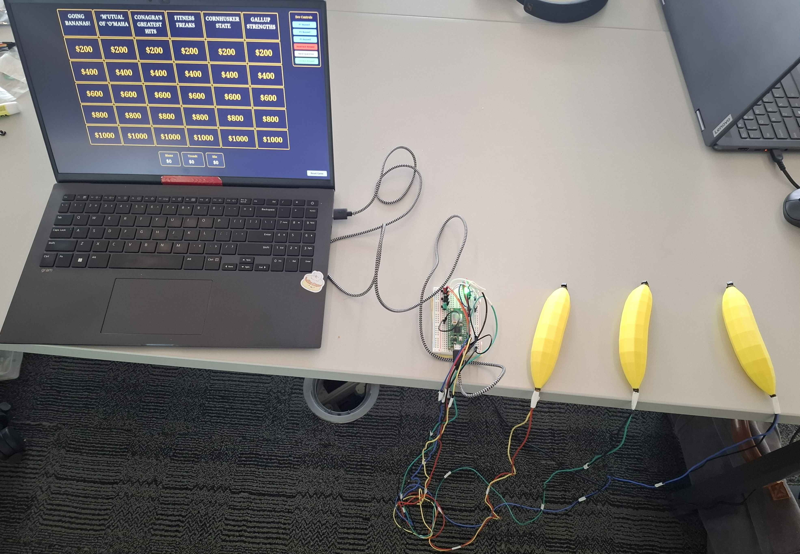

# Banananeopardy

A MicroPython-based quiz / buzzer server that runs on a Raspberry Pi Pico 2W and serves a web-based frontend. Works without internet so you can play wherever you are!

The hardware of the project contains buzzers in the shape of bananas to have an ergonomic feel!

This repository contains the Pico-side WebSocket server and a web client (in the `web/` folder) used to play a Jeopardy-like buzzer game.



## Features

- WebSocket server that broadcasts button (buzzer) events to connected clients.
- Simple static web UI (HTML/JS) served from the device that connects to the WebSocket.
- Designed to run under MicroPython on a Raspberry Pi Pico W or 2W.

## Team

1. Daniel Kasparek - User Experience Lead
2. Adam Messman - Materials Expert
3. Maitreyi Purandare - Creative Lead
4. Blaine Traudt - Hardware Integrator

## Tech Stack

- Python (Micropython)
- HTML
- CSS
- JS

## Project layout

- `Banananeopardy/`
  - `main.py` — entrypoint for the Pico 2W; starts WiFi, performs a hardware enable-pin check, runs the WebSocket server and main event loop.
  - `websocket_helper.py` — lower-level handshake/WS helpers used by the server.
  - `ws_server.py`, `ws_connection.py` — WebSocket server and connection abstractions.
  - `gpio.py` — GPIO/button handling (reads hardware buttons and exposes events).
  - `wireless.py` — WiFi connection helper.
  - `secrets.py.example` — example WiFi credentials file (copy this to `secrets.py` and fill in your credentials).
- `web/` — static web frontend including `index.html` and `game.html`.

## Requirements

- Raspberry Pi Pico W (or 2W) with WiFi support.
- Associated peripherals (banana buzzers)
- MicroPython firmware for the Pico 2W (latest stable that includes network/uasyncio/uhashlib support).
- A way to copy files to the board (Thonny, rshell, ampy, or similar).

Note: the code uses MicroPython-specific modules such as `uasyncio`, `ubinascii`, `uhashlib`, and `machine` — this is not for desktop CPython.

## Quick start

1. Flash MicroPython firmware for the Pico 2W. Follow the official Raspberry Pi documentation for your board.

2. Copy the repository files to the Pico 2W's filesystem (the board's root). Using Thonny is the easiest route for most users:

   - Open Thonny, connect to the Pico 2W.
   - Copy `Banananeopardy/` files to the device (preserve filenames). Make sure `main.py` is present on the device's root — MicroPython will run `main.py` on boot.

3. Create `secrets.py` on the device by copying `secrets.py.example` and filling in your Wi‑Fi credentials. The file should define your SSID and password for the AP (see `secrets.py.example` for the expected variables).

4. Ensure your hardware enable pin is set correctly. `main.py` contains a failsafe check using GPIO 21 — the code exits if pin 21 is not pulled to GND. Tie that pin to GND if it's not already.

5. Reboot the board or run `main.py`. The console will print the assigned IP address after a successful WiFi connection. Example output (serial):

```text
AP Available!
SSID: SSID
PASSWORD: PASSWORD
IP Address: 192.168.4.1
```

6. Open a browser and navigate to `http://<device_ip>/` (for example `http://192.168.4.1/`) to load the web UI. The frontend connects via WebSocket and receives button events from the Pico.

## Development notes

- The WebSocket server logic is based on and includes code headers with MIT-licensed fragments from Florin Dragan. See the license comments in `websocket_helper.py` and related files.
- The project is written for MicroPython — debugging is easiest with Thonny connected to the board's serial REPL.
- For local development of the web UI, you can open `web/index.html` directly in a browser, but to connect to the Pico's WebSocket you will need to point the client to the device IP/port or host the web files under the device's served path.

## Troubleshooting

- If you don't see an IP printed on boot, double-check your `secrets.py` values and WiFi network availability.
- If `main.py` exits immediately with "enable-pin not connected to GND, exit", connect GPIO 21 to ground or comment out the check in `main.py` for development.
- If clients cannot connect to the WebSocket, confirm the board and the client are on the same network and that the printed IP is reachable from your browser/device.
